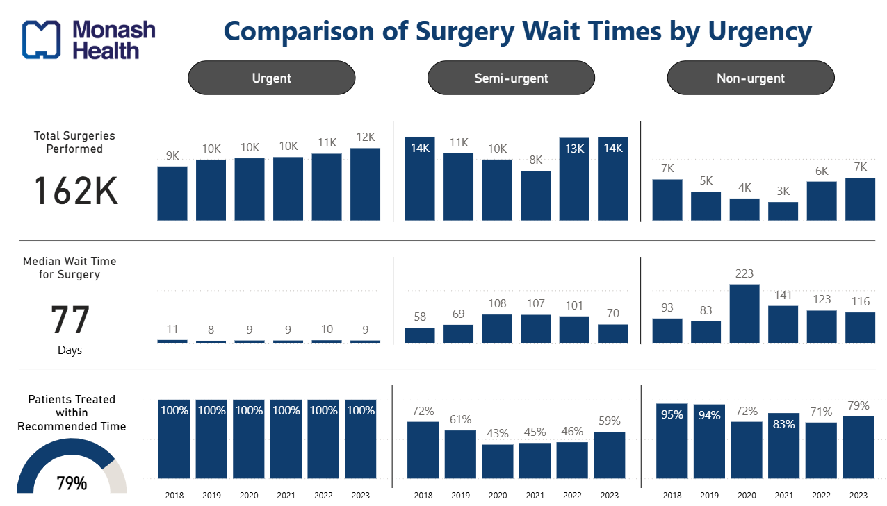

# 🏥 Elective Surgery Waiting Times – Monash Health (2018–2024)

📊 **Power BI Dashboard | Healthcare Analytics Portfolio**



---

## 🔍 Project Overview

This Power BI dashboard analyzes **elective surgery wait times** at **Monash Health**, a major Local Hospital Network in Australia, from **2018 to 2024**. It identifies trends, post-COVID disruptions, and specialties or procedures with the longest delays.  

The dashboard demonstrates skills in:
- Data modeling and transformation (Power BI, DAX)
- Healthcare KPI development
- Operational and clinical performance analysis
- Effective stakeholder-driven storytelling

---

## 🏥 Business Context

Elective surgery wait times are key performance indicators for hospital efficiency and patient access. This dashboard helps decision-makers understand how service delivery has evolved, especially during and after the COVID-19 pandemic.

---

## 🎯 Key Stakeholder Questions

| Stakeholder                | Key Question                                                                                  | Business Value                  |
|---------------------------|-----------------------------------------------------------------------------------------------|----------------------------------|
| Clinical Services Manager | Which **procedures or specialties** face the longest wait times?                              | Operational, Patient Access     |
| Hospital Operations Lead  | How has **COVID-19** impacted waiting times across urgency levels?                            | Efficiency, Resilience Planning |
| Quality & Safety Team     | What % of patients were treated **within recommended clinical timeframes**?                   | Compliance, Quality of Care     |
| Department Heads          | Are delays **concentrated in specific specialties or procedures**?                            | Resource Allocation             |

---

## 📊 KPIs Visualized

- 📅 **Median Waiting Time** (in days)
- ✅ **% Patients Treated on Time**
- 🔧 **Top 5 Procedures** by delay
- 🧪 **Top 5 Specialties** by wait time
- 🕒 Year-wise trends by **urgency level** (Non-urgent, Semi-urgent, Urgent)

---

## 💡 Insights

- Non-urgent surgeries experienced **peak delays in 2020–21**, likely due to COVID restrictions.
- Urgent surgeries were mostly treated **within recommended timeframes** across all years.
- Specialties like **ENT**, **Gynaecology**, and **Vascular Surgery** had elevated wait times.
- Procedures such as **vaginal repair** and **rhinoplasty** saw significant year-on-year increases in wait time.

---

## ⚙️ Tools Used

| Tool        | Purpose                            |
|-------------|-------------------------------------|
| Power BI    | Data modeling and visualization     |
| DAX         | KPI measures and dynamic filtering  |
| Excel       | Preprocessing source data           |
| Git/GitHub  | Version control and portfolio       |

---

## 📁 Files

```
/elective-surgery-wait-times/
│
├── Monash_ElectiveSurgery.pbix       # Power BI report
├── Monash_WaitTimes.xlsx             # Source data (MyHospitals.gov.au)
├── dashboard-preview.png             # Dashboard image
├── README.md                         # This file
```

---

## ✅ Getting Started

1. Clone or download this repository.
2. Open `Monash_ElectiveSurgery.pbix` in **Power BI Desktop**.
3. Load `Monash_WaitTimes.xlsx` as the data source.
4. Use slicers to filter by **year**, **measure**, or **patient cohort**.

---

## 📌 About Me

I'm a biomedical engineer and healthcare data analyst, with experience in hospital operations, bioprocess modeling, and clinical performance reporting. This project is part of my professional portfolio showcasing real-world analytics in healthcare.

📧 [Email Me](mailto:your.email@example.com)  
🌐 [LinkedIn](https://www.linkedin.com/in/your-profile)

---

